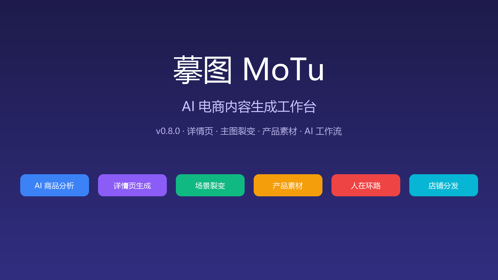
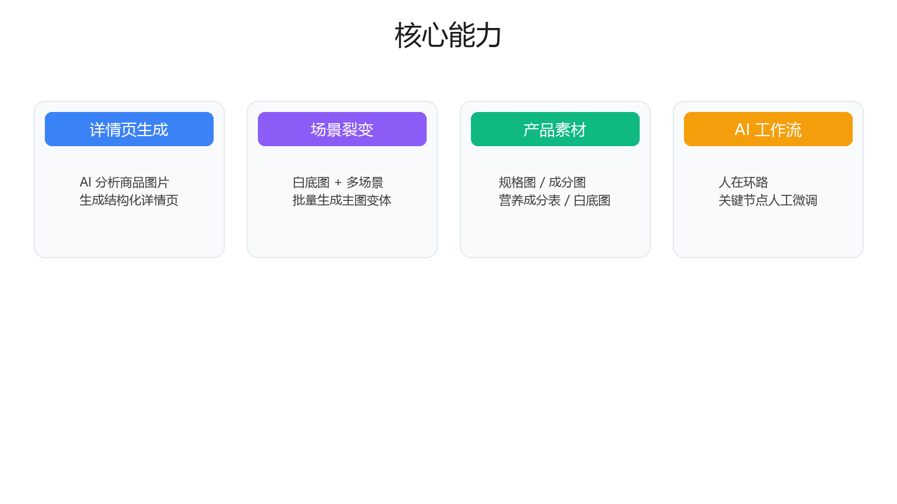
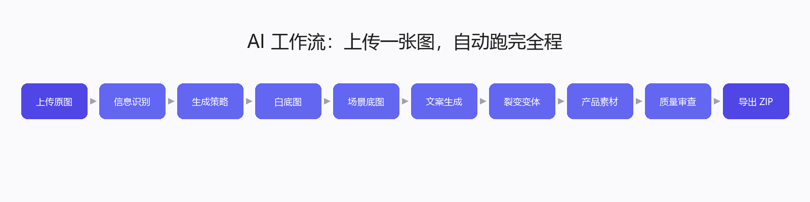

# 摹图 🍌

> AI-powered e-commerce content generation workspace
> AI 电商内容生成与编辑工作台

---

<p align="center">
  
  
  
  
  
  
  
</p>

---

## ✨ Overview / 项目简介

**摹图（MoTu）** 是一个 AI 原生的电商内容工作台，面向真实电商运营流程设计。

它能把商品图片转化为：

- 结构化、高转化的详情页
- 多场景、多文案的电商主图
- 白底图、规格图、成分图、营养成分表等产品素材
- 按店铺/链接组织好的 ZIP 分发包

核心目标是让同一商品在 10+ 店铺、每天 10+ 链接上架时，实现 **“上传一张图 → AI 自动执行 → 人在关键节点微调 → 批量导出”**。

---



---

## 🧠 What You Can Do / 核心能力

### 1. 详情页工作台 / Detail Page Workspace

- 🖼️ 上传商品图片，自动解析产品信息
- ✍️ AI 生成结构化详情页方案
- 🧩 模块级编辑、重生成、版本管理
- 📱 手机模拟器预览完整长页

### 2. AI 场景裂变 / Hero Scene Fission

- 🎨 上传商品原图，AI 生成白底产品图
- 🌅 基于白底图批量融合多场景背景
- 📝 自动生成文案 + 多排版裂变变体
- 💾 白底图复用，同一商品只生成一次

### 3. 产品素材生成 / Product Assets

- 🧊 白底商品图
- 📐 规格参数图
- 🧪 成分/配料图
- 🍎 营养成分表

### 4. AI 自动化工作流 / Human-in-the-Loop Workflow

- 🤖 上传原图后 AI 自动跑完全流程
- ✋ 每个关键阶段自动暂停，等待人工确认或修改
- 🏪 自动按“店铺 → 链接 → 主图 → 素材图”组织导出
- 🔍 AI 自动审查合规、质量、一致性并输出评分

### 5. 多模型接入 / Multi-Model Provider

- 🔌 任意 OpenAI-compatible API
- 🧪 Gemini / OpenAI / 自定义模型
- 🎯 自动识别模型能力（vision / image_gen / structured_output）
- 💻 同时支持 Web 与 Electron 桌面端

---

## 📸 Demo / 示例展示

### 核心能力概览


### AI 工作流流水线


---

## 🚀 Quick Start / 快速开始

```bash
npm install
npm run prisma:generate
npm run prisma:migrate
npm run dev
```

Then open the local address printed by Next.js.  
请打开 Next.js 启动后输出的本地访问地址。

---

## 🔑 Environment / 环境变量

Create `.env` based on `.env.example`:

```env
OPENAI_API_KEY=
OPENAI_BASE_URL=
DATABASE_URL=
STORAGE_ROOT=./storage
```

Supports any OpenAI-compatible API.  
支持任意 OpenAI-compatible API（包括代理或自建服务）。

你也可以不修改 `.env`，直接在页面右上角 **AI 配置** 中设置 Provider：


---

## 🎯 AI 工作流使用说明

1. 进入 **AI 工作流** 页面。
2. 上传一张商品原图，点击 **创建并运行**。
3. AI 自动依次执行：
   - 信息识别
   - 生成策略
   - 白底图生成
   - 场景底图生成
   - 文案生成
   - 裂变变体合成
   - 产品素材生成
   - 质量审查
   - 导出打包
4. 每个关键阶段完成后会暂停，你可以在页面右侧检查、修改，然后点 **继续**。
5. 最终自动生成按店铺/链接组织的 ZIP，可直接下载。

---

## 🏗 Architecture / 技术架构

- **Next.js 14** (App Router)
- **TypeScript**
- **Tailwind CSS + shadcn/ui**
- **Prisma + SQLite**（本地优先）
- **本地文件系统存储**
- **OpenAI-compatible AI 适配层**
- **Electron + electron-builder**（桌面端）
- **Python + Pillow**（图片合成）

---

## 💻 Web + Desktop / Web 与桌面端

### Web

```bash
npm run dev
npm run build && npm run start
```

### Desktop (Windows EXE)

```bash
npm run build:desktop
npm run dist:win
```

Web 与 Desktop 共用同一套业务逻辑：

> Electron + Next.js standalone + electron-builder

---

## 📦 Project Structure / 项目结构

```
app/                    # Next.js App Router
  api/                  # API routes
  hero-*/               # Hero image / workflow pages
components/             # UI components
  analysis/
  editor/
  layout/
  projects/
  ui/
lib/                    # Core logic
  ai/                   # AI adapters, prompts, schemas
  db/                   # Prisma client
  services/             # Business services
  storage/              # File storage
  utils/                # Utilities
prisma/                 # Database schema & migrations
desktop/                # Electron entry
scripts/                # Build & utility scripts
types/                  # TypeScript types
```

---

## ⚠️ Notes / 注意事项

- 日志、存储数据、本地数据库不会提交到 git。
- `.env` 文件不会被提交。
- 设计为本地优先，数据默认保存在本地。
- AI 工作流涉及大量图片生成，建议配置稳定的 vision + image_gen 模型。

---

## 📖 Docs / 文档

- 中文文档：[README.zh-CN.md](./README.zh-CN.md)
- English Docs：[README.en.md](./README.en.md)

---

## 🧠 Vision / 项目愿景

> Turn ideas into products, instantly.  
> 让想法，直接变成商品。

---

## 📌 Roadmap / 发展规划

- [x] AI 商品分析与详情页生成
- [x] 批量主图与场景裂变
- [x] 产品素材生成（白底图 / 规格图 / 成分图 / 营养成分表）
- [x] AI 自动化工作流 + 人在环路
- [x] 按店铺 / 链接自动导出
- [ ] 一键上传到拼多多 / 淘宝店铺后台
- [ ] 模板市场
- [ ] 多人协作
- [ ] 云端版本

---

## 🤝 Contributing / 贡献

PRs are welcome.  
欢迎提交 PR。如有问题请提交到 issue。

---

## ⭐ Support / 支持

If you like this project, give it a star ⭐  
如果你觉得这个项目不错，欢迎点个 Star ⭐

## Star History

<picture>
  <source
    media="(prefers-color-scheme: dark)"
    srcset="https://api.star-history.com/svg?repos=liyaow880715-afk/motu_new&type=Date&theme=dark"
  />
  <source
    media="(prefers-color-scheme: light)"
    srcset="https://api.star-history.com/svg?repos=liyaow880715-afk/motu_new&type=Date"
  />
  
</picture>

<div align="center">

**Made with ❤️ by 零禾（上海）网络科技有限公司**

让灵感落地，让回忆有形

</div>
